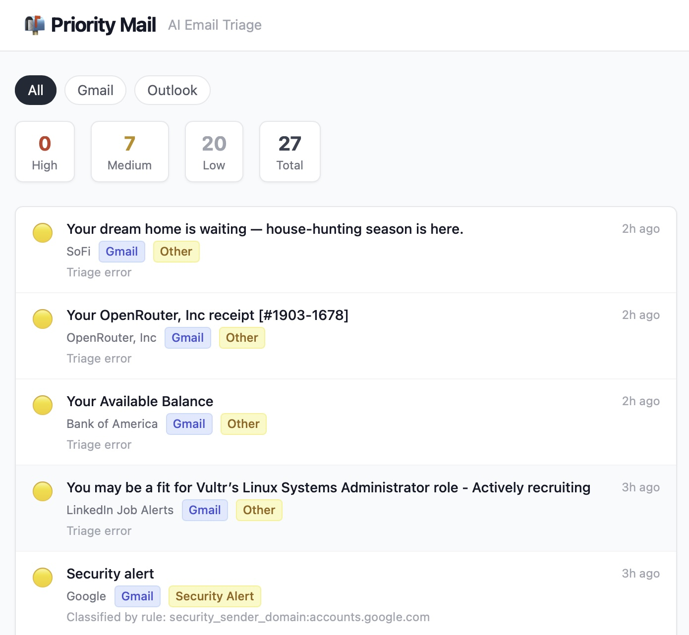
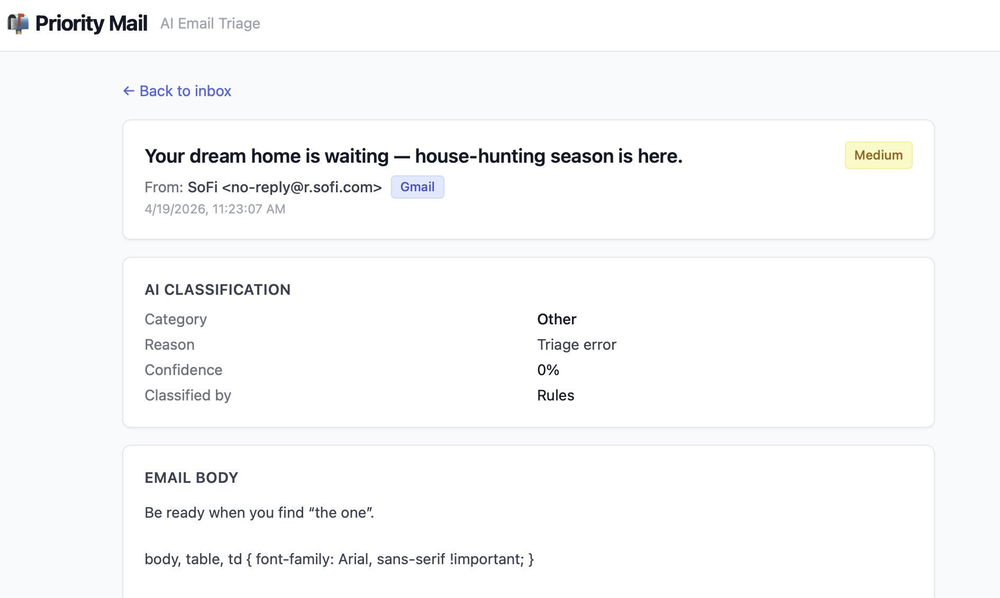

# Priority Mail

An AI-powered email triage assistant that reads your inbox and helps you decide what needs attention — without taking any automatic actions. The AI recommends, the human approves.


<p><em>Main dashboard with priority categories and source filtering</em></p>


<p><em>Deep dive into AI-generated reasoning, category, and priority for a single message</em></p>

## What it does

- Fetches unread emails from **Gmail** (Google API) and **Outlook / O365** (Microsoft Graph API)
- Runs a fast, free **Rules Engine** (newsletters, promotions, security alerts) to pre-classify emails without touching the AI
- Sends remaining emails to an **AI Classifier** (OpenRouter) for priority, category, reasoning, task extraction, and draft reply generation
- Routes confidential emails to a **local AI** (Ollama-compatible) — they never leave your machine
- Serves classified emails via a **REST API** (Express + PostgreSQL)
- Displays them in a clean **Next.js dashboard** sorted by priority — with **All / Gmail / Outlook** filter tabs and per-provider source badges

## Quick Start (Docker)

### Prerequisites

- Docker + Docker Compose
- A Google Cloud project with the Gmail API enabled and OAuth credentials (Desktop app type)
- An [OpenRouter](https://openrouter.ai) API key

### 1. Configure credentials

```bash
cp connectors/gmail/.env.example connectors/gmail/.env
# Fill in: GMAIL_CLIENT_ID, GMAIL_CLIENT_SECRET, GMAIL_ACCOUNT_EMAIL, OPENROUTER_API_KEY
```

### 2. Authorize Gmail (one-time, runs locally)

```bash
cd connectors/gmail
npm install
npm run auth
# Follow the prompts, paste the refresh token back into connectors/gmail/.env
```

### 3. Start the stack

Use the provided development script to manage the environment:

```bash
./dev.sh
```

### 4. Fetch and triage emails

**One-shot mode (manual run):**
```bash
./dev.sh --connectors
```

**Daemon mode (scheduled polling):**
Set `POLL_INTERVAL_SECONDS=300` in your connector `.env` file, then:
```bash
docker compose up -d gmail-connector
```

### 5. Open the dashboard

Navigate to [http://localhost:3000](http://localhost:3000)

### 6. Email Retention Policy

By default, Priority Mail purges emails from the database based on their priority:
- **Low**: 48 hours
- **Medium**: 1 week
- **High**: 1 month

> **Using Outlook instead of (or in addition to) Gmail?**  
> See [`connectors/o365/README.md`](connectors/o365/README.md) for the Azure App Registration setup and one-time PKCE auth flow, then run:
> ```bash
> docker compose run --rm o365-connector
> ```

---

## Project Structure

```
priorityMail/
├── connectors/
│   ├── gmail/              # Gmail fetcher + Rules Engine + AI Classifier
│   └── o365/               # Outlook / O365 fetcher (Microsoft Graph API)
├── backend/                # Express REST API + PostgreSQL
├── frontend/               # Next.js dashboard
├── docs/                   # Planning and design documents
└── docker-compose.yml      # Full stack orchestration
```

## Tech Stack

| Layer       | Technology                          |
|-------------|-------------------------------------|
| Frontend    | Next.js 14 + React + TypeScript + Tailwind |
| Backend     | Node.js + Express + TypeScript      |
| Database    | PostgreSQL 16                       |
| Queue       | Redis 7 (reserved for future use)   |
| AI          | OpenRouter API (cloud) / Ollama (local) |
| Email       | Gmail API (OAuth2) · Microsoft Graph API (PKCE) |

## Key Features

- **Rules first, AI second** — deterministic rules slash AI token costs
- **Privacy-aware routing** — emails with confidentiality notices are routed to a local AI (Ollama), never to a cloud provider
- **Security email protection** — 2FA / OTP emails are never sent to any AI
- **User feedback loop** — users can approve, dismiss, or correct AI classifications
- **No automatic actions** — every suggestion requires explicit user approval
- **48-hour retention** — background cleanup process purges old emails automatically

## Environment Variables

See `connectors/gmail/.env.example`, `connectors/o365/.env.example`, and `backend/.env.example` for the full list of required variables. Full documentation in [`DEVELOPMENT.md`](DEVELOPMENT.md).
